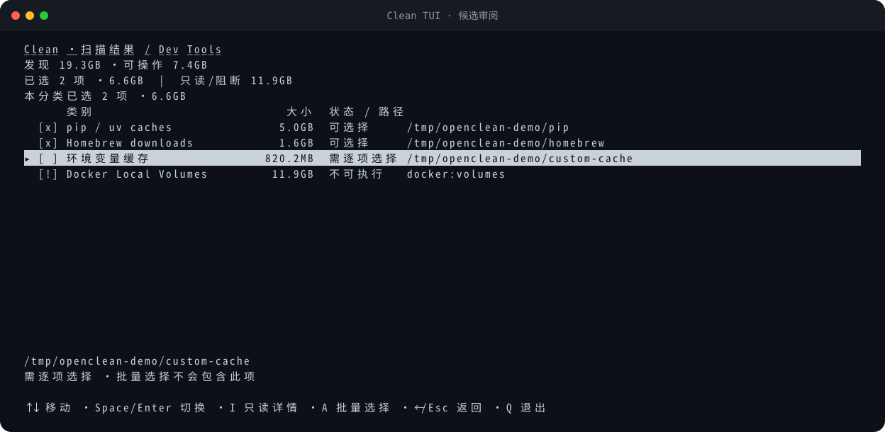

<div align="center">

# open-cleanmymac

macOS 磁盘清理 CLI · 安装后的命令名为 **`openclean`**

[](https://github.com/BlueSkyXN/open-cleanmymac/actions/workflows/ci.yml)
[](CHANGELOG.md)
[](https://www.python.org/downloads/)
[](docs/PREVIEW.md)
[](LICENSE)

[功能预览](docs/PREVIEW.md)
· [能力地图](docs/CAPABILITIES.md)
· [架构](docs/ARCHITECTURE.md)
· [安全政策](SECURITY.md)
· [AI 只读调用](docs/AI_USAGE.md)
· [贡献指南](CONTRIBUTING.md)
· [规格索引](specs/_index.md)

</div>

依据仓库内的功能规格做净室实现：不复用参考软件的代码、私有规则库或商业数据。
默认只扫描和预览；显式 `--yes` 才会移动或删除文件。缺少安全公开接口的能力保持
fail-closed，不会伪报成功。

> **会操作文件。** 不带 `--yes` 的命令只读；清理、清空 Trash 和 Docker prune 可能
> 永久删除数据。请先跑隔离预览，再阅读 [安全](#安全)。

当前基线是 **0.23.0 Alpha**：用户态扫描、预览、选择、同卷 Trash、空间分析、TUI、
JSON、项目产物清理和受限 Docker prune 已实现。特权帮助器和
`optimize ram / purgeable` 执行器不可用。尚未发布 PyPI、Homebrew 或 GitHub Release。

<p align="center">
  
</p>

上图由当前 Clean TUI 的生产绘制函数生成，使用固定合成候选；不读取真实 `HOME`、
Docker daemon 或云文件。更多画面见 [docs/PREVIEW.md](docs/PREVIEW.md)。

## 目录

- [快速开始](#快速开始)
- [功能](#功能)
- [命令](#命令)
- [安全](#安全)
- [架构](#架构)
- [开发](#开发)
- [仓库边界](#仓库边界)
- [许可证](#许可证)

## 快速开始

要求：macOS、Python 3.11+。当前 CI 只验证 Python 3.11。开发工具版本统一记录在
`requirements-dev.txt`。

### 隔离预览（推荐先做）

```bash
git clone https://github.com/BlueSkyXN/open-cleanmymac.git
cd open-cleanmymac
make preview
```

`make preview` 不扫描真实 `HOME`。它在 `TemporaryDirectory` 里构造夹具，预览并执行
19 个隔离场景，最后报告 `real_user_data_modified=false`。覆盖五域扫描、四类
`clean`、`purge`、`analyze`、ignore/config 生命周期、临时清理执行，以及两个
`optimize` 安全拒绝。完整说明见 [docs/PREVIEW.md](docs/PREVIEW.md)。

### 安装

```bash
python3 -m venv .venv
.venv/bin/python -m pip install ./implementation
.venv/bin/openclean --version
```

### 只读入门

```bash
.venv/bin/openclean scan --json
.venv/bin/openclean clean dev --no-interactive
.venv/bin/openclean purge ~/Projects --no-interactive
.venv/bin/openclean analyze ~ --no-interactive
.venv/bin/openclean ignore list
.venv/bin/openclean config
```

这些命令不会执行清理。不要在尚未审阅候选时给清理命令加 `--yes`。

## 功能

- 五域只读扫描：system、developer、ai、trash、project
- 用户态清理默认预览，显式 `--yes` 才写入；普通项走同卷 Trash
- 精确 `--select` 不继承默认预选，也不会批量扩大到同等级候选
- Docker 只开放固定 prune 白名单；Volumes、特权路径和签名 app 修改保持拒绝
- `make preview` 在临时目录演示全部非交互命令，不碰真实 `HOME`
- 运行时零第三方依赖；JSON schema v2 区分可回收、特权和不支持容量

| 能力 | 预览 | 执行 | 当前边界 |
|---|---|---|---|
| 五域扫描（system / developer / ai / trash / project） | 是 | 只读 | `scan` 始终只读 |
| `clean junk / dev / ai` | 是 | 用户态 | 默认预览；`--yes` 才执行当前选择 |
| `clean trash` | 是 | 永久删除 | `confirm`；清空内容，保留 Trash 根 |
| `purge [path]` | 是 | 用户态 | 旧产物默认预选；普通项移到同卷 Trash |
| `analyze [path]` | 是 | 精确选择 | TUI / JSON / 行式导航；不删除 Time Machine 快照 |
| Docker daemon 容量 | 是 | 受限 | 三类 prune 需精确选择和 CLI/target binding；Volumes 拒绝；真实 daemon 待验收 |
| ApplicationLanguages | 是 | 否 | 只读审计；不修改签名 app |
| Broken startup items | 是 | 用户项 | 系统项需要尚未实现的特权帮助器 |
| Time Machine 本地快照 | 是 | 否 | 只显示数量/名称；公开列表不提供精确大小 |
| 签名托管知识库 | 客户端完成 | 显式更新 | 需用户提供 HTTPS URL 和钉住的公钥；项目不内置服务端 |
| `optimize ram / purgeable` | 命令面 | 否 | `status=unavailable`，退出码 1 |
| SMAppService / XPC 特权清理 | — | 否 | 需要 native host/helper、签名、entitlements 和真实安装验收 |
| universal binary thinning | — | 否 | 未实现；不修改签名应用包 |

扫描域：

| 域 | 典型内容 |
|---|---|
| system | 用户缓存/日志、诊断报告、Xcode、失效启动项、应用语言只读审计 |
| developer | pip、uv、npm、Cargo、Homebrew、Docker daemon 报告 |
| ai | Claude、Codex、Gemini、OpenCode、Cursor 缓存 |
| project | `node_modules`、`.venv`、`target`、DerivedData 等可重建产物 |
| trash | 当前用户与挂载卷的 Trash 根目录 |

逐项来源、验证证据和有意排除项见 [docs/CAPABILITIES.md](docs/CAPABILITIES.md)。

当前不在范围内：Desktop GUI、菜单栏、后台 agent、应用卸载、恶意软件扫描。需要外部签名、
真实 Docker daemon、正式知识库服务或不存在安全公开 API 的能力，会以
`guarded-unavailable` / `external-prerequisite` 展示，而不是伪造执行结果。

## 命令

```text
openclean scan [--domain DOMAIN] [--json [--redact-paths]]
openclean clean [junk|dev|ai|trash] [selection options] [--yes]
openclean purge [PATH] [selection options] [--yes]
openclean analyze [PATH] [--top N] [--select PATH] [--yes]
openclean optimize {ram,purgeable} [--json]
openclean ignore {list,add,remove}
openclean config [--analytics on|off]
openclean cat [--json]
```

连接 TTY 时，`clean`、`purge` 和 `analyze` 默认进入 curses 全屏界面。JSON、管道、
`--no-interactive` 或任何参数化选择 flag 走非交互流程。`clean` / `purge --select`
是独立精确模式：不继承默认预选，也不会因 `--include-confirm` 或
`--include-critical` 扩大到同等级其他候选。完整参数以
`openclean <command> --help` 为准。

JSON schema 当前为版本 `2`：

| 字段 | 含义 |
|---|---|
| `potential_bytes` | 发现的物理占用 |
| `reclaimable_bytes` | 当前实现可执行候选的物理占用 |
| `requires_privilege_bytes` | 需要尚未实现的特权能力 |
| `unsupported_bytes` | 当前明确不支持执行的候选 |

默认 JSON 保留精确绝对路径，供 `--select`、恢复审计和配置 readback 使用。分享输出时
加 `--redact-paths`：同一文档内的路径映射为稳定的 `path:0001` opaque ref，并标记
`selection_replayable=false`。脱敏输出不能直接作为后续 selector；该 flag 只影响最终
序列化，不改变扫描、选择或执行目标。URL、snapshot name 和 process marker 不在路径
脱敏范围内。

## 安全

| 操作 | 是否写入 | 可恢复性 |
|---|---|---|
| `scan`、不带 `--yes` 的 `clean` / `purge` / `analyze` | 否 | 不适用 |
| 普通 `clean` / `purge` / `analyze --yes` | 是 | 通常移动到同卷 Trash，可手工恢复 |
| `clean trash --select EXACT_ROOT --include-confirm --yes` | 是 | 永久删除所选 Trash 内容 |
| Docker prune | 是 | 永久操作；不经过 Trash，必须精确选择资源 identifier |
| `ignore add/remove`、`config --analytics` | 是 | 修改本地 `0600` JSON 配置 |
| `config --update-knowledge` | 网络 + 写入 | 验签、防回滚后原子安装规则 |

执行链会在扫描、批量预检和最终移动前重复检查保护规则、inode、owner、挂载点、云占位、
运行中进程和 symlink 边界。macOS 上优先使用 Darwin `SF_DATALESS`，并以
`st_blocks == 0 && st_size > 0` 作为保守兜底；这不等于识别所有已经 materialized 的
云同步文件。环境变量缓存路径只允许落在受信缓存根下，并强制精确选择。Docker 三类
prune 不参与默认或批量选择。

`safe`、`confirm`、`critical` 是候选风险级别，不是数据价值保证。用户规则中的
`ignore` / `protect` 是额外保护层，不能代替备份和人工审阅。路径竞态、Trash 身份、
Docker binding 和知识库安装细节见 [SECURITY.md](SECURITY.md)。

## 架构

模块化单体 CLI：当前用户态能力共享同一进程、数据模型和文件系统事务边界。未来的 macOS
特权操作才需要独立 native host/helper 和 XPC。

```text
CLI / TUI / JSON
      │
      ▼
任务 DAG + 加权进度 + 五域扫描编排
      │
      ▼
扫描点 / 动态发现 / 文件计量 / 进程保护
      │
      ▼
Predicate + KnowledgeBase 最外层保护闸
      │
      ▼
Item / ScanIssue / ScanResult
      │
      ├── 只读报告
      └── 显式选择 → 执行前复核 → Trash / Docker 白名单
```

模块职责、数据流、信任边界和未来 XPC 分层见
[docs/ARCHITECTURE.md](docs/ARCHITECTURE.md)。净室规格入口是
[specs/_index.md](specs/_index.md)。

## 开发

```bash
python3 -m pip install -r requirements-dev.txt
make lint
make test
make preview
make check
make package
make release-check
```

当前本地基线通过 319 个 `unittest` 和 19/19 隔离预览场景；最终事实以 CI 和当前
checkout 的实际运行结果为准。CI 在 macOS / Python 3.11 上执行 lint、测试、预览、构建、
归档审计和隔离 wheel 安装，不发布 PyPI、Homebrew 或 GitHub Release。

| 文档 | 用途 |
|---|---|
| [CONTRIBUTING.md](CONTRIBUTING.md) | 净室边界、开发环境和检查门 |
| [CHANGELOG.md](CHANGELOG.md) | 用户可见变更 |
| [docs/AI_USAGE.md](docs/AI_USAGE.md) | AI agent 的只读调用边界与 JSON 判读方式 |
| [implementation/README.md](implementation/README.md) | 安装入口、选择语义、JSON 与规则格式 |
| [implementation/TODO.md](implementation/TODO.md) | 当前开发缺口 |

## 仓库边界

| 路径 | 作用 |
|---|---|
| `implementation/` | Python 包、测试、隔离预览与发行检查 |
| `specs/` | 净室功能规格和实现状态 |
| `docs/` | 架构、能力地图与功能预览 |
| `analysis/` | 受隔离的原始分析材料；被 `.gitignore` 排除，禁止提交/读取 |
| `local/` | 本机过程材料；被 `.gitignore` 排除 |

本项目与 MacPaw 或 CleanMyMac **没有关联**，也不受其背书。产品名仅用于描述兼容目标
和研究背景。项目不包含参考软件代码、私有 `.cmmkb` 数据、密钥或用户机器扫描结果。

## 许可证

本项目采用 [GNU General Public License v3.0](LICENSE)。

当前公开的是源码与 CI 基线，不是已签名的产品发布。创建 tag、GitHub Release 或发布
PyPI / Homebrew 公式前，仍需单独完成发行审阅。
