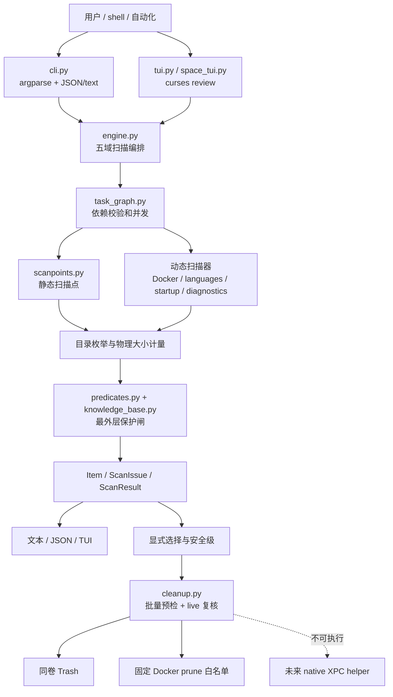
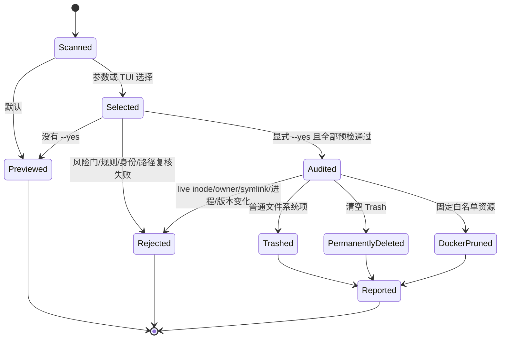

# 架构说明

[README](../README.md) · [能力地图](CAPABILITIES.md) ·
[功能预览](PREVIEW.md) · [安全](../SECURITY.md) ·
[规格索引](../specs/_index.md) · [实现说明](../implementation/README.md)

本文描述 `openclean` 的模块、数据流和信任边界。参考软件的功能事实位于 `specs/`。
用户入口见 [README.md](../README.md)；能力状态见 [CAPABILITIES.md](CAPABILITIES.md)；
选择语义与 JSON 字段见 [implementation/README.md](../implementation/README.md)；
报告渠道与威胁模型见 [SECURITY.md](../SECURITY.md)。

## 1. 架构定义

项目采用**模块化单体 CLI**：用户态能力共享同一个进程、数据模型和文件系统事务边界。
只有未来的 macOS 特权操作必须跨越权限边界，届时才建设独立 native host/helper 和 XPC。

## 2. 模块边界

| 模块 | 职责 | 不负责 |
|---|---|---|
| `cli.py` | 参数契约、命令编排、文本/JSON 输出、退出码 | 文件删除细节 |
| `redaction.py` | JSON 单文档 opaque path refs | 改写扫描/选择/执行对象 |
| `models.py` | `Item`、身份快照、issue 和聚合指标 | 扫描策略 |
| `scanpoints.py` | 五域静态扫描点和安全元数据 | 文件系统访问 |
| `engine.py` | 根展开、并发扫描、计量、重叠归属、项目发现 | 用户交互 |
| `filesystem.py` | `lstat` / `scandir` / `statvfs` 的 EINTR-safe 只读封装 | 路径策略或删除 |
| `application_ownership.py` | 公开缓存路径到应用进程 marker | 私有厂商规则 |
| `updater.py` | 已知 updater 根、bundle metadata、版本比较 | 执行暂存代码 |
| `storage_diagnostics.py` | 只读空间诊断 | 删除诊断对象或读取正文 |
| `task_graph.py` | DAG 校验、就绪调度、依赖失败传播 | 业务规则 |
| `progress.py` | 固定权重、单调快照、TTY renderer | 任务执行 |
| `predicates.py` | 组合谓词、KB 优先的保护闸 | 规则持久化 |
| `knowledge_base.py` | JSON schema、规则匹配、用户 ignore | 远程下载 |
| `knowledge_update.py` | HTTPS 验签、防回滚、原子安装 | 内置服务 URL/公钥 |
| `cleanup.py` | 选择、预检、Trash 操作、执行报告 | 特权提升 |
| `macos.py` | Trash、Darwin cache、mount、Time Machine | 通用业务编排 |
| `docker.py` | 只读容量、target binding、三条 prune 映射 | 任意 Docker 命令或 volume 删除 |
| `tui.py` / `space_tui.py` | 审阅与确认 | 绕过 `cleanup.py` |

`application_languages.py`、`startup_items.py` 和 `storage_diagnostics.py` 返回统一
`Item`/`ScanIssue`，但不能自行删除目标。

## 3. 核心数据模型

`Item` 同时描述发现结果和当前能否执行：路径或 identifier、物理/逻辑大小、safety、
actionable、特权/云占位阻断、选择标记、扫描时身份。扫描结果不是删除计划；不可执行项
的 `reclaimable_bytes` 为 0。`analyze` 只描述占用，顶层和 entry 的 `reclaimable_bytes`
固定为 0。JSON 字段见实现契约。

`ScanIssue` 使用稳定 code 和 `blocking`。`complete=true` 表示没有取消且没有 blocking
issue；自动化仍应检查全部 `issues`。

`CleanupReport` 区分 `moved_to_trash_bytes`（暂存、尚未释放）和
`permanently_deleted_bytes`（Trash 清空或 Docker prune）。

## 4. 扫描与调度

1. CLI 按 domain 装配静态和动态任务。
2. `task_graph.py` 拒绝重复 ID、未知依赖、自依赖和环。
3. 就绪任务并发运行；依赖失败只阻断下游。
4. 进度按固定权重聚合；只有成功任务进入 `complete + 100%`。
5. 遍历不跟随 symlink，硬链接按 `(device, inode)` 去重，物理大小用 `st_blocks * 512`。
6. Darwin `SF_DATALESS` 与 zero-block 启发式在枚举前阻止 dataless/疑似占位。
7. `analyze` 按一级候选固定 `st_dev` 与 `statvfs().f_fsid`，跨文件系统挂载点不计容量。
8. 已知应用归属同时覆盖专用扫描点和通用用户缓存入口；进程未知时 fail-closed。
9. 保护规则在读取候选细节前短路；结果按声明顺序汇总。

专项诊断（retention、SQLite、updater temp、Codex 临时结构、deleted-open）一律只读，
不进入 cleanup 状态机。JSON `volumes` 按 scan-time device 分组文件系统候选；Docker 等
非文件系统资源不进入卷汇总。

## 5. 写操作状态机

批量预检 all-or-nothing：任一选中项在执行前失败，整批不开始。每项操作前再次复核。
没有 `--select` 时应用默认预选和 tier 批量 flag；出现 `--select` 后选择集从空开始。
完整选择规则见实现契约。

## 6. 路径与竞态防护

- 路径先做词法规范化，不用一次 `realpath()` 作为安全保证。
- 从可信 anchor 逐组件拒绝 symlink ancestor；扫描、预检和最终移动都复核身份。
- 环境变量扫描根只允许 `~/Library/Caches` 或 `~/.cache`，并要求精确选择。
- 普通 Trash 移动使用 no-follow 目录 fd 和 Darwin `renameatx_np(RENAME_EXCL |
  RENAME_NOFOLLOW_ANY)`；目标必须属于当前用户且权限私有。
- rename 成功是提交边界；后置 fd 清理失败返回 `partial` 并保留已移动事实。
- 清空 Trash 只处理最终审计快照，不删除 Trash 根，也不删除审计后新到达的项。
- `SF_DATALESS` 在枚举和最终移动前检查。这些措施降低 TOCTOU，但不是对同 UID 恶意进程
  的绝对隔离。

## 7. 外部边界

**Docker.** 扫描固定 CLI realpath、context/host、endpoint 和 Engine ID；binding 随
actionable Item 传到 cleanup，不进入 JSON。prune 前即时复核；Volumes 永远拒绝。probe
与 prune 是多个 CLI 进程，不提供同一 API connection 的原子绑定。

**托管知识库.** 只由显式 HTTPS 命令触发：验签、钉住公钥和 sequence，再以
`0600 + fsync + os.replace` 安装。项目不内置第三方规则。

**特权 XPC.** 当前 wheel 没有 host/helper/签名链，特权候选 `actionable=false`。启用门槛
见 [specs/04-ipc-protocol.md](../specs/04-ipc-protocol.md)。

## 8. 包装与发布边界

- wheel 只包含运行时包和 console script；
- sdist 有意包含 tests、隔离 preview、release checker 和 checkout 便捷入口；
- CI 只构建短期 artifact，不自动创建 tag 或 GitHub Release；正式版本仅通过 GitHub Release 发布，
  项目不通过 PyPI、Homebrew 或其他包管理器分发；
- 仓库以 [GNU GPL v3](../LICENSE) 许可。
