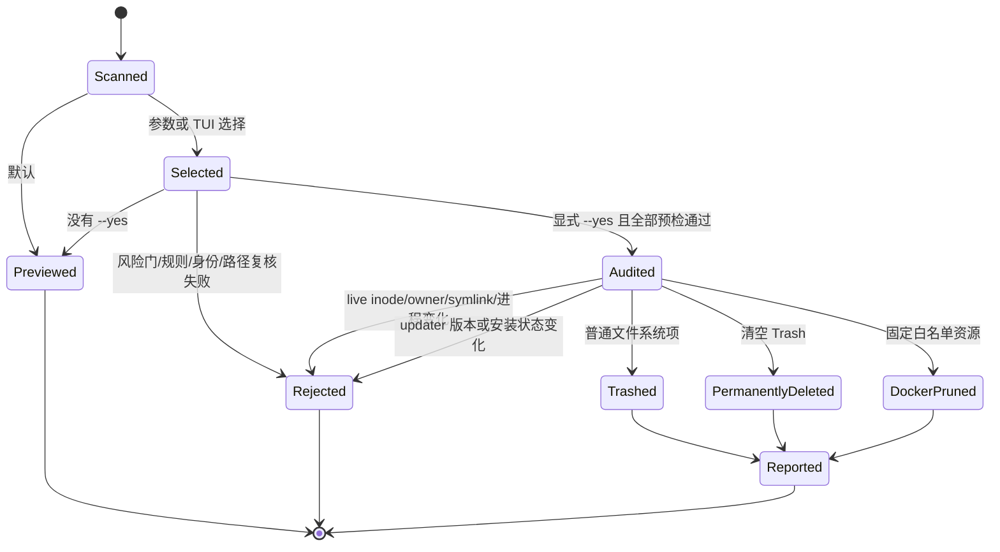

# 架构说明

[README](../README.md) · [能力地图](CAPABILITIES.md) ·
[功能预览](PREVIEW.md) · [安全](../SECURITY.md) ·
[规格索引](../specs/_index.md) · [实现说明](../implementation/README.md)

本文描述 `openclean 0.23.0` 的实际实现架构。参考软件的功能事实位于 `specs/`；本文件
只描述本项目自己的模块、数据流和安全边界。用户入口见 [README.md](../README.md)。

## 1. 架构定义

项目采用**模块化单体 CLI**，理由是当前所有用户态能力共享同一个进程、数据模型和
文件系统事务边界，不需要为扫描域引入服务间通信。只有未来的 macOS 特权操作必须跨越
权限边界，届时才建设独立 native host/helper 和 XPC 协议。

## 2. 模块边界

| 模块 | 职责 | 不负责 |
|---|---|---|
| `cli.py` | 参数契约、命令编排、文本/JSON 输出、退出码 | 文件删除细节 |
| `redaction.py` | JSON 单文档 opaque path refs 与自由文本路径收口 | 改写扫描/选择/执行对象 |
| `models.py` | `Item`、身份快照、issue 和聚合指标 | 扫描策略 |
| `scanpoints.py` | 五域静态扫描点和安全元数据 | 文件系统访问 |
| `engine.py` | 根展开、并发扫描、计量、重叠归属、项目发现 | 用户交互 |
| `filesystem.py` | `lstat` / `scandir` / `statvfs` 的 EINTR-safe 只读封装 | 路径策略或删除 |
| `application_ownership.py` | 公开缓存路径到应用进程 marker 的保守归属 | 私有厂商规则或进程枚举 |
| `updater.py` | 已知 updater 根、app/ZIP bundle metadata、版本状态比较 | 执行暂存代码或自动安装 |
| `storage_diagnostics.py` | 日志/runtime/download retention、Darwin transient 与 SQLite freelist 只读诊断 | 删除诊断对象、`VACUUM` 或读取正文/包内容 |
| `task_graph.py` | DAG 校验、就绪调度、依赖失败传播 | 业务规则 |
| `progress.py` | 固定权重、单调快照、TTY renderer | 任务执行 |
| `predicates.py` | 组合谓词、KB 优先的保护闸 | 规则持久化 |
| `knowledge_base.py` | JSON schema、规则匹配、用户 ignore 原子写入 | 远程下载 |
| `knowledge_update.py` | HTTPS、OpenSSL 验签、跨进程防回滚、公钥钉扎、原子安装 | 内置服务 URL/公钥 |
| `cleanup.py` | 选择、预检、原子 no-replace Trash 操作、审计快照、执行报告 | 特权提升 |
| `macos.py` | Trash、Darwin cache、mount、Time Machine 发现和路径边界 | 通用业务编排 |
| `docker.py` | 只读容量、target binding 和三条固定 prune 映射 | 任意 Docker 命令或 volume 删除 |
| `tui.py` | clean/purge 分组复选与确认 | 直接执行文件操作 |
| `space_tui.py` | analyze 导航、跨层选择、Finder reveal | 绕过 `cleanup.py` |

`application_languages.py`、`startup_items.py` 和 `storage_diagnostics.py` 是专项扫描器。
它们返回统一的 `Item` 和 `ScanIssue`，但不能自行删除目标。

## 3. 核心数据模型

### Item

`Item` 同时描述“发现了什么”和“当前能否执行”。关键字段包括：

- `path` 或资源 `identifier`；
- 物理 `size`、逻辑大小、dataless/疑似云占位计数、`cross_device_paths`；
- `safety`、`actionable`、`requires_privilege`、阻断原因；
- `preselected`、`requires_explicit_selection`；
- 扫描来源 `path_source`，例如 builtin/environment；
- 扫描时记录的 device/inode/owner 身份；
- updater installed/staged 版本、状态和外置安装提示；
- `diagnostic_kind`、日志 7/14/30 天容量/文件数/句柄，或 SQLite page/freelist/WAL 指标；
- project、Docker、startup item 等领域元数据。

扫描结果不等于删除计划。任何不可执行项的 `reclaimable_bytes` 都是 0；其占用只计入
`potential_bytes`，并按特权或不支持原因单独聚合。`analyze` 更严格：它只描述空间占用，
因此即使候选可供用户精确选择，顶层和 entry 的 `reclaimable_bytes` 也固定为 0。

### ScanIssue

issue 使用稳定 code、message、task、path 和 `blocking`。`complete=true` 表示没有取消
且没有 blocking issue；非阻断提示仍可能说明某个动态来源被安全跳过。自动化消费者应
同时检查 `issues`，不能只看退出码。

### CleanupReport

执行报告区分：

- `moved_to_trash_bytes`：数据已暂存到 Trash，尚未释放物理空间；
- `permanently_deleted_bytes`：Trash 清空或 Docker prune 实际释放；
- 每个 outcome 的 status、目标、目的地、受影响大小和消息。

## 4. 扫描与调度

1. CLI 根据 domain 装配静态和动态任务。
2. `task_graph.py` 在执行前拒绝重复 ID、未知依赖、自依赖和环。
3. 就绪任务在线程池并发运行；依赖失败只阻断下游，独立任务继续。
4. 每个任务在启动前获得固定权重，进度按
   `sum(task_progress * weight) / sum(weight)` 聚合。
   任务终态区分成功、失败和取消；只有成功任务进入 `complete + 100%`。
5. 目录遍历不跟随 symlink，硬链接按 `(device, inode)` 去重，物理大小用
   `st_blocks * 512` 计量。
6. Darwin `SF_DATALESS` 与 zero-block 启发式会在目录枚举前阻止 dataless/疑似云占位；
   它们不计入可回收空间，重叠父子候选最终只归属一次容量。
7. `analyze` 按一级候选同时固定 `st_dev` 与 `statvfs().f_fsid`，其它文件系统挂载点不会
   被递归计入；后者覆盖 macOS APFS root/Data 可能共享 `st_dev` 的情况。发生跳过时候选
   保留只读容量但不可执行。
8. 已知应用归属保护既作用于专用扫描点，也作用于通用用户缓存入口；运行中或进程状态
   未知时保留候选并置为不可执行。
9. `lstat` / `scandir` 的 `EINTR` 会透明重试；保护规则在读取候选细节前尽早短路，结果按
   声明顺序稳定汇总。
10. 已知 updater 只读取受限 `Info.plist` 或 ZIP 顶层 bundle metadata；待安装新版、应用
    缺失和未知状态不可执行，同版/旧版降为 critical 精确选择。
11. retention 扫描只读取文件 metadata 并报告 7/14/30 天物理容量；SQLite 使用 immutable
    read-only PRAGMA。两类诊断始终不可执行，也不进入 cleanup 状态机。
12. Qoder ShipIt 的 Darwin temp 根由 `getconf` 动态发现，复用 updater 版本判定，但完整
    app 副本始终只读报告，避免把暂存状态或应用缺失误当作清理授权。
13. Darwin `T/X` 仅按公开名称模式发现构建临时目录、版本化 runtime、toolhost snapshot、
    UURemote temp 与 code-sign clone；通用 Darwin cache 直接子项按公开 bundle/helper 名称
    继承应用进程保护，不从真实机器数据生成私有路径规则。

JSON 的 `volumes` 按 scan-time device 分组文件系统候选，分别汇总系统盘与外置盘容量。
Docker 等非文件系统资源不进入卷汇总；`device_id` 不是跨重启的持久标识。

## 5. 写操作状态机

批量预检采用 all-or-nothing 启动策略：任何选中项在执行前失败，整个批次不开始。每项
实际操作前仍再次复核，防止扫描与执行之间状态变化。

参数选择分为两种互斥语义：没有 `--select` 时应用默认预选和 tier 批量 flag；一旦出现
`--select`，选择集从空开始，`--include-confirm`/`--include-critical` 只作为所选目标的
风险授权，不再批量扩展到其他候选。`--select` 与 `--all` 因语义冲突直接返回用法错误。

## 6. 路径与竞态防护

- 路径先做词法规范化，不用一次 `realpath()` 作为安全保证。
- 从可信 anchor 到候选逐组件拒绝 symlink ancestor。
- 环境变量扫描根只允许位于 `~/Library/Caches` 或 `~/.cache`，并标记为
  `environment + confirm + requires_explicit_selection`。
- `analyze` 的每个一级候选限制在其自身 device + filesystem identity；跨边界后代只产生
  非阻断 issue 和计数，不计容量且使包含它的候选不可执行。
- 公开维护的应用归属规则会给通用 `~/Library/Caches` 候选附加进程 marker，避免从通用
  扫描入口绕过运行中进程保护。
- updater 同版/旧版残留在批量预检时重新读取 installed/staged 版本；状态或版本变化会
  取消整批执行，待安装新版和未知状态不会进入执行器。
- 普通 Trash 移动逐组件用 `O_NOFOLLOW | O_DIRECTORY` 打开目录 fd；最终使用
  Darwin `renameatx_np(RENAME_EXCL | RENAME_NOFOLLOW_ANY)` 原子拒绝覆盖。
- per-user Trash 必须由当前 uid 所有且使用私有权限；新建目录通过可信父目录 fd 相对
  创建，no-follow 打开并绑定 path/fd identity 后才执行 `fchmod`，最终再次复核
  device/inode/owner/mode。
- rename 成功是 Trash 移动提交边界；后置 fd close 错误返回 `partial` 并保留 destination，
  源目录和 Trash 目录 fd 始终独立尝试关闭。
- 清空 Trash 使用最终审计快照和 fd-relative `unlink/rmdir`，不删除 Trash 根目录，也不
  删除审计后新到达的项。
- 清理前的后代树复核同样使用 no-follow 目录 fd、`fstat` 和 `scandir(fd)`；每层重新检查
  directory、owner、device 和 dataless 状态，并用父路径 + entry name 重建完整路径。
- 每次目录枚举前检查 macOS `SF_DATALESS`；普通文件另保留 zero-block 保守兜底，防止
  扫描本身触发 File Provider materialization。
- 扫描、批量预检、最终移动均复核 inode、类型、owner、mount 和保护规则。

这些措施降低 TOCTOU 风险，但 Python 用户态进程不是安全沙箱。工具只对当前用户明确
授权的候选执行操作，不把当前实现描述为对恶意同 UID 进程的绝对隔离。
`SF_DATALESS` 也不保证识别所有已 materialized、但仍由云服务同步的对象。

## 7. 外部边界

### Docker

扫描先固定 Docker CLI 的 canonical realpath，再解析当前 context 与 endpoint，并用明确
`--context` 或 `--host` 取得 Engine ID 和 `docker system df --format json`；内部 canonical
binding 随 actionable Item 传到 cleanup，但不进入 JSON 或日志。prune 前重新解析 CLI 并
复核 endpoint/TLS mode 和 Engine ID；CLI realpath 变化或即时复核发现不一致时拒绝执行。
执行器仍只映射固定 builder/image/container prune，Local Volumes 始终不可执行；启动后的
timeout 或非零退出按副作用未知的 `partial` 报告。realpath binding 不等于二进制内容或
code-signature pinning，复核与 `exec` 也不是原子操作；同一路径下的 CLI 就地升级仍属于
真实环境验收边界。

probe 与 prune 是多个 Docker CLI 进程，不能提供同一 Engine API connection 的原子
precondition；当前实现是 fail-closed 的即时复核，真实 daemon/context/TLS 仍需单独验收。

### 托管知识库

网络更新不是后台行为，只由显式 `config --update-knowledge HTTPS_URL` 触发。客户端限制
大小、拒绝 URL 凭据和 HTTPS 降级，验证规范 JSON 的 SHA-256 签名，钉住公钥指纹和
sequence，再以 `0600 + fsync + os.replace` 安装。`os.replace` 是提交边界；后置目录同步和
fd 清理为 best effort，不会覆盖已安装结果。项目不内置第三方规则和未知 trust root。

### 特权 XPC

当前 Python wheel 没有 host app、helper、entitlements 或签名链，所有特权候选都在模型层
`actionable=false`。未来实现必须是独立 native 交付物，并满足：audit token/designated
requirement 双向校验、领域操作白名单、helper 端重新推导路径、fd-based no-follow、协议
版本/大小/超时/幂等约束，以及安装升级/回滚验收。不能暴露通用 `{delete, path}` API。
详见 [specs/04-ipc-protocol.md](../specs/04-ipc-protocol.md)。

## 8. 包装与发布边界

- wheel 只包含运行时包和 console script；
- sdist 有意包含 tests、隔离 preview、release checker 和 checkout 便捷入口，保证源码归档
  可自验证；
- CI 只构建并上传短期 artifact，不创建 tag、GitHub Release、PyPI 或 Homebrew 发布；
- 仓库以 [GNU GPL v3](../LICENSE) 许可。
