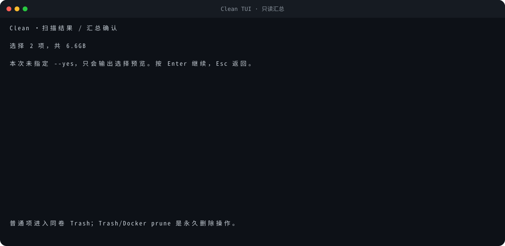
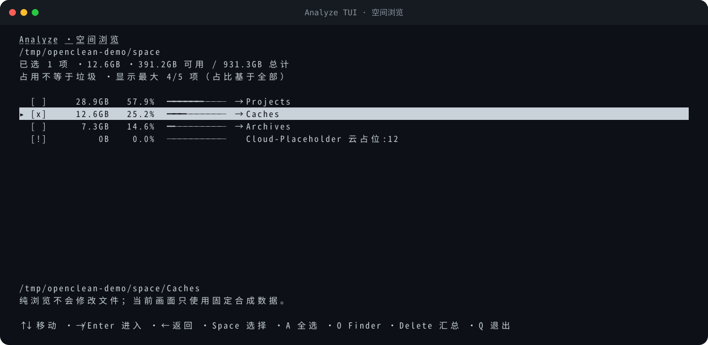

# 全功能隔离预览

[README](../README.md) · [能力地图](CAPABILITIES.md) ·
[架构](ARCHITECTURE.md) · [安全](../SECURITY.md) ·
[规格索引](../specs/_index.md) · [实现说明](../implementation/README.md)

本项目提供一个可重复、无需触碰真实用户数据的功能预览：

```bash
make preview
```

机器可读版本：

```bash
cd implementation
PYTHONPATH=. python3 scripts/preview_all.py --json
```

## 隔离保证

预览脚本在 `TemporaryDirectory` 中创建独立 `HOME`、规则文件、配置、Trash、项目、缓存、
应用语言包和分析文件。所有允许写入的演示都只作用于这些临时夹具。脚本结束时临时目录
由 Python 清理，并在结果中输出：

```json
{
  "workspace": "TemporaryDirectory",
  "real_user_data_modified": false,
  "passed": true,
  "scenario_count": 19
}
```

脚本会 mock 动态进程、Docker、Trash 和语言偏好发现，避免读取或调用真实 Docker daemon、
真实用户 Trash、正式规则服务和特权 helper。它不需要也不会请求 sudo。

## 实际运行结果

以下精简 transcript 来自当前 checkout 的真实 `make preview`，所有路径均由
`TemporaryDirectory` 合成；省略了分隔线和外部能力清单：

```text
open-cleanmymac · 隔离功能预览
所有写操作均限制在 TemporaryDirectory；不会修改真实 HOME。
PASS  version                            exit=0   openclean 0.23.0
PASS  scan-all-domains                   exit=0   隔离扫描得到 9 个候选，覆盖五域
PASS  clean-junk-preview                 exit=0   junk 只读预览 2 个候选
PASS  clean-dev-preview                  exit=0   dev 只读预览 2 个候选
PASS  clean-ai-preview                   exit=0   ai 只读预览 2 个候选
PASS  clean-trash-preview                exit=0   trash 只读预览 2 个候选
PASS  purge-preview                      exit=0   项目产物按项目分组，只读预览成功
PASS  analyze-preview                    exit=0   一级空间分析、排序和卷信息预览成功
PASS  ignore-lifecycle                   exit=0   临时 rules.json 完成增查删
PASS  config-lifecycle                   exit=0   analytics 仅写入临时 0600 配置
PASS  cat                                exit=0   终端猫 JSON 输出成功
PASS  clean-junk-temp-execution          exit=0   临时同卷 Trash 执行成功
PASS  clean-dev-temp-execution           exit=0   临时同卷 Trash 执行成功
PASS  clean-ai-temp-execution            exit=0   临时同卷 Trash 执行成功
PASS  clean-trash-temp-execution         exit=0   精确清空一个 Trash；第二个保持未选
PASS  purge-temp-execution               exit=0   旧项目产物移到临时同卷 Trash
PASS  analyze-temp-execution             exit=0   精确选择项移到临时同卷 Trash
PASS  optimize-ram-guard                 exit=1   无安全公开执行器时明确拒绝
PASS  optimize-purgeable-guard           exit=1   无安全公开执行器时明确拒绝
结果：19/19 个可执行预览场景通过。
```

这里的 `exit=1` 是 `optimize` 的预期 guard 契约，不是 preview failure。测试还验证
`clean trash --select ONE` 不会携带另一个默认/同等级候选，避免精确选择扩大范围。

## 合成 TUI 视觉预览

以下 SVG 不是手绘 mockup：生成器直接调用当前生产 TUI 的 `_draw_*` 函数，在固定的
`24×120` 合成 screen 上绘制固定候选。它们不启动真实终端，也不读取真实用户目录、
Docker daemon、File Provider 或网络服务。

### Clean 候选审阅

画面同时展示默认选择、需要逐项选择的 confirm 候选和永远拒绝 prune 的 Docker
Local Volumes。


### 未授权时的汇总页

没有 `--yes` 时，汇总页明确说明只输出选择预览，不会写文件。



### Analyze 空间浏览

画面展示大小、占比、目录导航、选择状态、云占位提示和 `--top` 截断数量。



重新生成或只读核对：

```bash
make docs-assets
cd implementation
PYTHONPATH=. python3 scripts/capture_tui_assets.py --check
```

SVG 只使用静态元素，无脚本、`foreignObject`、外部字体或外部 URL；`make check` 会做
确定性字节核对。它们证明当前绘制逻辑和文档资产一致，但不代替不同 macOS Terminal、
字体与窗口尺寸的像素级验收。

## 覆盖场景

| 分组 | 场景 |
|---|---|
| 基础 | version、cat |
| 扫描 | system/developer/ai/trash/project 五域聚合 |
| 只读清理 | clean junk/dev/ai/trash |
| 项目 | purge 发现、分组、7 天预选 |
| 空间 | analyze 一级排序、卷信息 |
| 本地状态 | ignore add/list/remove、config analytics on/off |
| 临时执行 | clean junk/dev/ai、精确 clean trash、purge、analyze |
| 安全拒绝 | optimize ram、optimize purgeable |

`clean`、`purge` 和 `analyze` 的临时执行场景会验证：候选确实从夹具位置移走、普通项进入
临时同卷 Trash、清空临时 Trash 后根目录仍存在，以及 JSON report 的受影响字节合理。

## 不在隔离预览中伪造的能力

| 能力 | 预览状态 | 原因 |
|---|---|---|
| SMAppService/XPC 特权清理 | `external-prerequisite` | 需要 native app/helper、签名身份、Team ID 和真实安装验收 |
| Docker 真实 prune | `external-prerequisite` | 需要用户自己的 Docker CLI/daemon，且操作不可通过 Trash 恢复 |
| 签名托管知识库真实更新 | `external-prerequisite` | 需要项目 HTTPS channel 和正式公钥 |
| optimize ram/purgeable | `guarded-unavailable` | 没有已验证、安全、公开的等价接口 |
| universal binary thinning | `not-implemented` | 会影响签名与兼容性，当前不修改应用二进制 |

这些场景属于产品边界，不是 preview failure。

## 手工只读预览

安装后可以在真实机器上运行以下只读命令：

```bash
openclean scan --json
openclean clean junk --no-interactive
openclean clean dev --no-interactive
openclean clean ai --no-interactive
openclean clean trash --no-interactive
openclean purge ~/Projects --no-interactive
openclean analyze ~ --no-interactive --top 20
openclean ignore list --json
openclean config --json
openclean optimize ram --json
openclean optimize purgeable --json
```

最后两个命令预期退出码为 `1`，并输出 `status=unavailable`；这是安全锁，不是执行失败。

不要为了“体验完整流程”在真实数据上盲目添加 `--yes`。需要验证写路径时，优先使用本页
的隔离脚本，或自行在单独的临时目录中建立夹具。

## TUI 快捷键

### clean / purge

- `↑/↓`：移动；
- `Enter/→`：进入分组；`←`：返回；
- `Space`：切换当前项；`A`：切换当前组可执行项；
- `Enter`：进入汇总；
- `Y`：确认执行（仍要求启动命令带 `--yes`）；
- `!`：critical 项的独立二次确认；
- `Q`：取消。

### analyze

- `↑/↓`：移动；`Enter/→`：进入目录；`←`：返回；
- `Space/A`：选择；`O`：Finder reveal；
- `Delete`：查看选择汇总；
- `Y`：确认执行（仍要求 `--yes`）；`Q`：取消。

TTY 布局依赖终端尺寸。CI 验证逻辑、取消路径和确定性 SVG，不进行 macOS Terminal
像素级视觉验收。
JSON、管道、`--no-interactive` 以及 `--all`、`--include-confirm`、
`--include-critical`、`--select` 等参数化选择会进入文本流程，不打开 curses。

## 解释 JSON 与退出码

- `0`：命令按其契约完成；
- `1`：结果不完整、执行 outcome 失败，或能力明确 unavailable；
- `2`：参数、规则、路径或选择错误；
- `130`：用户中断。

`--json` 模式下，参数和运行时错误也会输出可解析 envelope。所有结果可能含绝对路径；
保存或分享前应脱敏。
