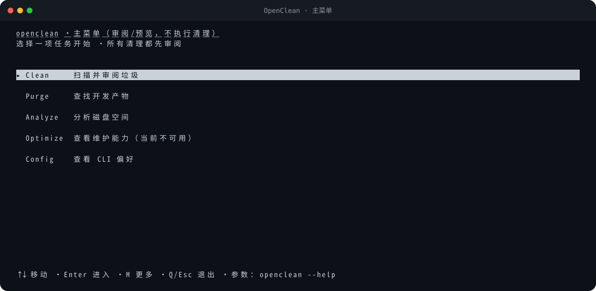
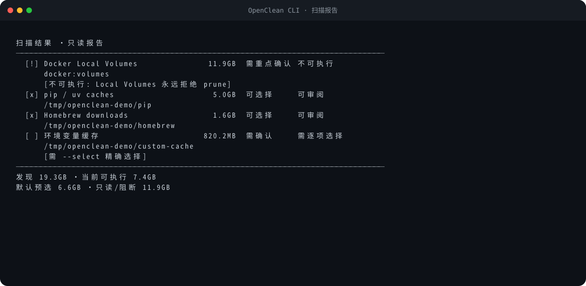
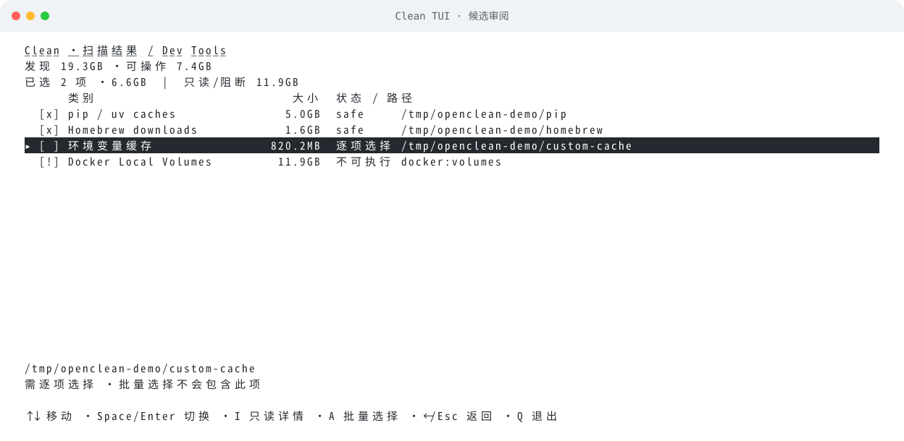
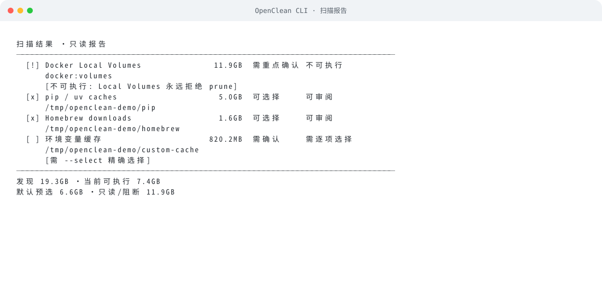
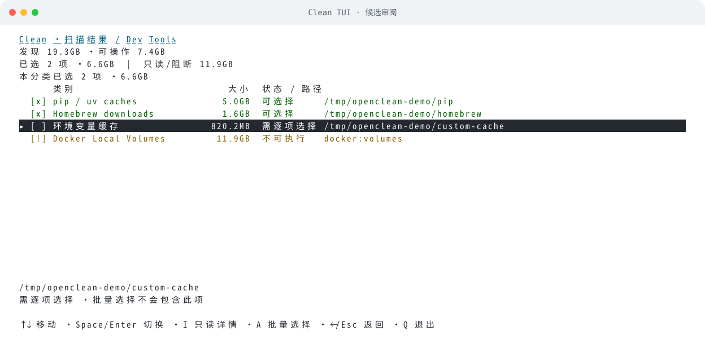
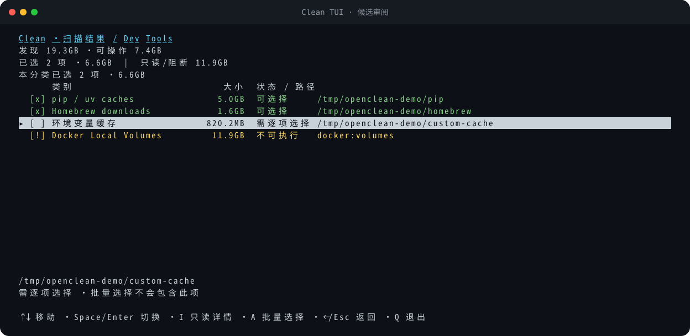
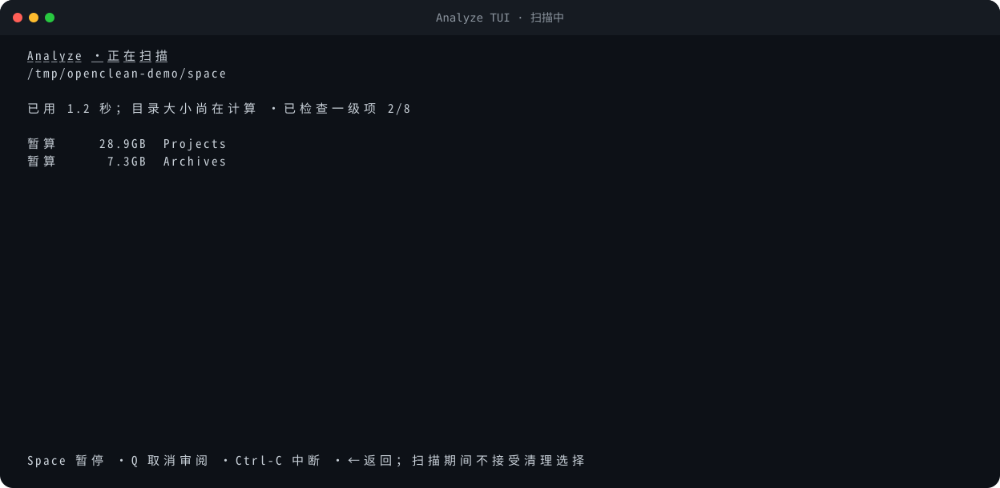

# 全功能隔离预览

[README](../README.md) · [能力地图](CAPABILITIES.md) ·
[架构](ARCHITECTURE.md) · [安全](../SECURITY.md) ·
[规格索引](../specs/_index.md) · [实现说明](../implementation/README.md)

`make preview` 是本项目的安全演示入口：在 `TemporaryDirectory` 中覆盖全部非交互命令族、
临时写路径和 guard 状态，不读取真实 `HOME`。curses TUI 另有由生产绘制函数生成的确定性
SVG，不冒充 macOS Terminal 截图。

> **两套命令面**：`make preview` 当前覆盖经典五域命令族及大文件扫描（`scan`/`clean`/`purge`/`analyze`/`large`/
> `optimize`/`ignore`/`config`/`cat`）。新增的 **Agent Runtime**（`inspect`/`show`/
> `clean --run --finding`/`strategy`，`codex`/`workbuddy` pack）的隔离端到端验证由 `test_agent_*` 与 `test_workbuddy.py`
> 承载（inspect→show→clean 预览→授权执行，全部在 `TemporaryDirectory` 内、mock 进程/句柄
> 快照），契约见 [实现说明](../implementation/README.md)。把 Agent 场景并入 `make preview`
> 是后续项。

```bash
make preview
```

机器可读版本：

```bash
cd implementation
PYTHONPATH=. python3 scripts/preview_all.py --json
```

> Agent 内置 Codex/WorkBuddy 策略只读；`inspect` 会写本机 Run Store。
> macOS 原生结果与 Linux 逻辑模拟不能混同，见 [当前状态](AGENT_RUNTIME_STATUS.md)。

## 隔离保证

后续源码的 Purge 候选沿用 note 显示具体清理后果和产物年龄，文本预览、I 详情与 JSON 使用同一份说明，
不改变选择。动态应用归属的定向测试使用临时应用和模拟 Spotlight/进程快照，覆盖未知、
多安装位置和执行前启动；不通过清理真实应用缓存验证保护。具体未发布变化见 CHANGELOG。

AI 浏览器补齐测试在临时 profile 中验证八个新增精确路径及相似路径反例、运行中 Chrome
阻断、JSON 预览和只移动选中缓存，保留登录态与未选数据；不启动真实浏览器或连接真实 profile。

预览脚本在 `TemporaryDirectory` 中创建独立 `HOME`、规则文件、配置、Trash、项目、缓存、
应用语言包和分析文件。所有允许写入的演示都只作用于这些临时夹具。脚本结束时临时目录
由 Python 清理，并在结果中输出：

```json
{
  "workspace": "TemporaryDirectory",
  "real_user_data_modified": false,
  "passed": true
}
```

脚本会 mock 动态进程、Docker、Trash 和语言偏好发现，避免读取或调用真实 Docker daemon、
真实用户 Trash、正式规则服务和特权 helper。它不需要也不会请求 sudo。
`scenario_count` 和逐场景结果以本次实际运行输出为准。

## 实际运行结果

以下精简 transcript 来自当前 checkout 的真实 `make preview`，所有路径均由
`TemporaryDirectory` 合成；省略了分隔线和外部能力清单：

```text
open-cleanmymac · 隔离功能预览
所有写操作均限制在 TemporaryDirectory；不会修改真实 HOME。
PASS  version                            exit=0   openclean 0.24.0a2
PASS  scan-all-domains                   exit=0   隔离扫描得到 8 个候选，覆盖五域
PASS  clean-junk-preview                 exit=0   junk 只读预览 2 个候选
PASS  clean-dev-preview                  exit=0   dev 只读预览 2 个候选
PASS  clean-ai-preview                   exit=0   ai 只读预览 1 个候选
PASS  clean-trash-preview                exit=0   trash 只读预览 2 个候选
PASS  purge-preview                      exit=0   项目产物按项目分组，只读预览成功
PASS  analyze-preview                    exit=0   一级空间分析、排序和卷信息预览成功
PASS  large-files-preview                exit=0   递归大文件发现、逻辑/物理计量与只读报告成功
PASS  ignore-lifecycle                   exit=0   忽略规则仅在临时 rules.json 中完成增查删
PASS  config-lifecycle                   exit=0   analytics 偏好仅写入临时 0600 配置
PASS  cat                                exit=0   终端猫 JSON 输出成功
PASS  clean-junk-temp-execution          exit=0   仅在 TemporaryDirectory 中移动到同卷 Trash
PASS  clean-dev-temp-execution           exit=0   仅在 TemporaryDirectory 中移动到同卷 Trash
PASS  clean-ai-temp-execution            exit=0   仅在 TemporaryDirectory 中移动到同卷 Trash
PASS  clean-trash-temp-execution         exit=0   精确清空一个临时 Trash；第二个 Trash 保持未选
PASS  purge-temp-execution               exit=0   旧项目产物仅移动到临时同卷 Trash
PASS  analyze-temp-execution             exit=0   精确选择项仅移动到临时同卷 Trash
PASS  optimize-ram-guard                 exit=1   无安全公开执行器时明确拒绝且非零退出
PASS  optimize-purgeable-guard           exit=1   无安全公开执行器时明确拒绝且非零退出
```

这里的 `exit=1` 是 `optimize` 的预期 guard 契约，不是 preview failure。测试还验证
`clean trash --select ONE` 不会携带另一个默认/同等级候选，避免精确选择扩大范围。

## 合成 TUI 视觉预览

这里展示的是终端内界面，不是独立桌面 GUI。当前绘制共用中文列宽、焦点和状态样式，
默认前景/背景沿用终端自身的颜色；设置 `NO_COLOR` 仍保留反白、下划线及文字状态。窄屏快捷键换行，
小于 48×14 时保留选择并提示放大。文档画面使用固定合成数据及可审计的生产绘制函数。

### 主菜单与 CLI 报告





CLI 保留完整路径并将说明分行，发现量、可操作量、选择量和只读/阻断量分别呈现；
输出不增加 ANSI 颜色或改变 JSON。TUI 使用整行焦点，选中与不可执行仍有独立文字标记。

以下 SVG 不是手绘 mockup：生成器直接调用当前生产 TUI 的 `_draw_*` 函数，在固定的
`24×120` 合成 screen 上绘制固定候选。它们不启动真实终端，也不读取真实用户目录、
Docker daemon、File Provider 或网络服务。

### Clean 候选审阅

画面同时展示默认选择、需要逐项选择的 confirm 候选和永远拒绝 prune 的 Docker
Local Volumes。


### 白底、深色与 iTerm2

默认 `OPENCLEAN_THEME=auto` 不猜测底色，而是直接使用终端默认前景/背景；切换 iTerm2
的浅色/深色 Profile 后无需同步修改 OpenClean。整行焦点交换前景/背景，不指定黑字青底；
提示使用正常强度，不依赖独立的 Bold Color、faint 强度或前 16 个 ANSI 色。

同一候选画面的白底版本，以及白底 CLI 报告：





需要状态颜色时，可为当前命令显式选择与终端背景匹配的主题：

```bash
OPENCLEAN_THEME=light openclean   # 白色/浅色底
OPENCLEAN_THEME=dark openclean    # 深色底
NO_COLOR=1 openclean             # 禁用自定义状态配色，保留反白焦点
```

显式配色仅在至少 256 色终端上启用，使用 16 以上的色索引并保留默认背景；`NO_COLOR`
优先于主题设置，能力不足或初始化失败时回到终端默认色。不修改 iTerm2/Terminal 偏好。





这些预览使用白色 `#ffffff` 和深色 `#0d1117` 作为参考背景，正文、状态及焦点文字的
对比度均通过至少 4.5:1 的自动检查；这不代表用户任意自定义 Profile 的对比度保证。
生成器调用生产配色初始化并记录实际色对，反白也按真实属性交换前景/背景。
[iTerm2 官方颜色文档](https://iterm2.com/documentation-preferences-profiles-colors.html)
说明了浅色/深色 Profile、ANSI、Bold、Faint 和 Minimum Contrast 等用户设置；
本项目的原生 macOS curses PTY 检查覆盖键盘和配色初始化，SVG 预览不等同于 iTerm2 GUI 实测。

### 未授权时的汇总页

没有 `--yes` 时，汇总页明确说明只输出选择预览，不会写文件。


### Analyze 空间浏览

画面展示大小、占比、目录导航、选择状态、只读原因、云占位提示和 `--top` 截断数量。
当前源码先显示扫描状态，结果分批出现；会话缓存支持返回，提交选择前重新复核。




重新生成或只读核对：

```bash
make docs-assets
cd implementation
PYTHONPATH=. python3 scripts/capture_tui_assets.py --check
```

SVG 只使用静态元素，无脚本、`foreignObject`、外部字体或外部 URL；云端 `make ci-check` 会做
确定性字节核对。它们证明当前绘制逻辑和文档资产一致，但不代替不同 macOS Terminal、
字体与窗口尺寸的像素级验收。

## 覆盖场景

| 分组 | 场景 |
|---|---|
| 基础 | version、cat |
| 扫描 | system/developer/ai/trash/project 五域聚合 |
| 只读清理 | clean junk/dev/ai/trash |
| 项目 | purge 发现、分组、7 天预选 |
| 空间 | analyze 一级排序、卷信息 |
| 大文件 | large 递归文件阈值、表观/已分配计量、零预选与只读 |
| 本地状态 | ignore add/list/remove、config analytics on/off |
| 临时执行 | clean junk/dev/ai、精确 clean trash、purge、analyze |
| 安全拒绝 | optimize ram、optimize purgeable |

`clean`、`purge` 和 `analyze` 的临时执行场景会验证：候选确实从夹具位置移走、普通项进入
临时同卷 Trash、清空临时 Trash 后根目录仍存在，以及 JSON report 的受影响字节合理。

## 不在隔离预览中伪造的能力

| 能力 | 预览状态 | 原因 |
|---|---|---|
| SMAppService/XPC 特权清理 | `external-prerequisite` | 需要 native app/helper、签名身份、Team ID 和真实安装验收 |
| Docker 真实 prune | `external-prerequisite` | 需要用户自己的 Docker CLI/daemon，且操作不可通过 Trash 恢复 |
| 签名托管知识库真实更新 | `external-prerequisite` | 需要项目 HTTPS channel 和正式公钥 |
| optimize ram/purgeable | `guarded-unavailable` | 没有已验证、安全、公开的等价接口 |
| universal binary thinning | `not-implemented` | 会影响签名与兼容性，当前不修改应用二进制 |

这些场景属于产品边界，不是 preview failure。

## 手工只读预览

安装后可以在真实机器上运行以下只读命令：

```bash
openclean scan --json
openclean clean junk --no-interactive
openclean clean dev --no-interactive
openclean clean ai --no-interactive
openclean clean trash --no-interactive
openclean purge ~/Projects --no-interactive
openclean analyze ~ --no-interactive --top 20
openclean ignore list --json
openclean config --json
openclean optimize ram --json
openclean optimize purgeable --json
```

最后两个命令预期退出码为 `1`，并输出 `status=unavailable`；这是安全锁，不是执行失败。

不要为了“体验完整流程”在真实数据上盲目添加 `--yes`。需要验证写路径时，优先使用本页
的隔离脚本，或自行在单独的临时目录中建立夹具。

## TUI 快捷键

### 无参数主菜单

- `↑/↓`、`Enter`：选择并进入 Clean、Purge、Analyze、Optimize 或 Config；
- `M`：More（命令速查/Cat/返回），根菜单 `Q/Esc` 退出，次级菜单 `Q/Esc` 返回；
- 子任务结束后按 Enter 返回原菜单；Optimize 的非零 refusal 原因保留可见；
- Analyze 先选择家目录、当前目录、自定义目录或启动盘；取消范围选择不会扫描；
- 主菜单只提供审阅/预览，不自动添加 `--yes`；初始化失败使用数字行式菜单；
- 非 TTY 无参数只输出帮助，不等待键盘。

### 扫描页（clean / purge / analyze 共用）

- `Space`：请求暂停/继续；“已暂停”只在实际任务到达暂停点后显示，阻塞 I/O 期间
  保持“暂停已请求”；
- `Q`：取消审阅（exit 0）；`Ctrl-C`：中断（exit 130）；取消后等待扫描线程收尾；
- Analyze 有历史目录时 `←` 放弃本次扫描返回；
- 扫描期间不接受清理选择；扫描转审阅边界上的 Space/Enter 会被清理，不会泄漏成
  第一次选择；
- clean/purge 显示任务清单（等待/进行中/完成/失败/已取消）与任务进度，Analyze
  显示已检查一级项数与当前处理对象。

### clean / purge

- `↑/↓`：移动；
- 分组页 `→`：进入逐项列表；`←/Esc`：返回；
- 列表 `Space/Enter`：切换当前项；`A`：批量选择符合原选择条件的可执行项；
- 列表 `I`：只读详情；`↑/↓` 滚动，`Esc/←` 返回，详情不改变选择；
- 列表页头部显示全局与本分类两层已选汇总；
- 分组页 `Enter`：进入汇总（无 `--yes` 时为“选择预览”，不写文件）；
- `Y`：确认执行（仍要求启动命令带 `--yes`）；
- `!`：critical 项的独立二次确认；
- `Q`：取消。

详情显示本次扫描已有证据：完整路径、说明、风险、年龄、句柄，以及保留期、SQLite、
updater、Codex 测量、Crashpad 或 deleted-open 指标；缺失值显示未知，不额外探测。
列表中的风险短语为“可选择/需确认/需重点确认”，内部枚举与 JSON 字段不变。
普通项移到 Trash 不等于空间已释放，诊断项不产生清理动作，子集锚点也不是整个父目录。

### analyze

- `↑/↓`：移动；`Enter/→`：进入目录；`←`：返回；
- `R`：刷新；返回已访问目录复用当前会话结果；
- `I`：当前项详情；`E`：全部问题（区分“问题”与“提示”）；详情中方向键滚动、Esc 返回；
- `Space/A`：选择可执行项；`O`：Finder reveal；
- 三态选择标记：`[ ]` 未选、`[x]` 已直接选择、`[-]` 目录内有独立选择、
  `[x] 随上级` 被祖先选择覆盖（调整需返回上级）；
- 头部两层汇总：全局已选 + “此目录内已选”（含更深层目标；目录整体或被上级选择时
  如实标注，不拆算父项计量）；
- `Delete`：重新复核选择来源后查看汇总（无 `--yes` 时为“选择预览”），变化项撤销；
- `Y` 后仍需 `!` 完成 critical 二次确认（要求 `--yes`）；执行动作是移动到同卷废纸篓；
- `Q`：取消审阅；`Ctrl-C`：中断。扫描期间只处理暂停/取消/返回，不接受清理选择。

TTY 布局依赖终端尺寸。CI 验证逻辑、取消路径和确定性 SVG，不进行 macOS Terminal
像素级视觉验收。
JSON、管道、`--no-interactive`、`--interactive` 冲突以及 `--all`、`--include-confirm`、
`--include-critical`、`--select` 等参数化选择的模式矩阵见 [MODES.md](MODES.md)。

## 解释 JSON 与退出码

- `0`：命令按其契约完成；
- `1`：结果不完整、执行 outcome 失败，或能力明确 unavailable；
- `2`：参数、规则、路径或选择错误；
- `130`：用户中断。

`--json` 模式下，参数和运行时错误也会输出可解析 envelope。默认结果保留精确绝对路径；
保存或分享时可加 `--redact-paths`，输出单文档 opaque refs 并声明不可用于 selector replay。
preview 仍使用精确临时路径做内部断言，不把脱敏输出当作真实 selector。
